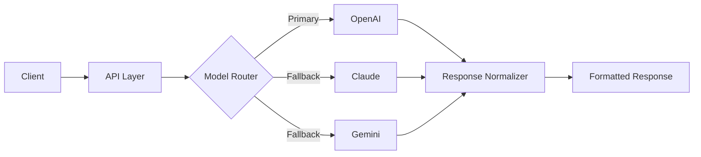

# 👋 Hi, I'm Samuel Alayande

### AI Product Engineer • Technical Founder • Multi-Model AI Systems • Fintech • Real-Time Platforms

I design and build scalable, production-ready systems across **AI, fintech, marketplaces, and real-time platforms** — with a strong focus on **architecture, reliability, and product-driven engineering**.

---

### Building practical systems from architecture → production-ready platforms

> **Production codebases are private.**  
> Public repositories focus on **architecture, system design, implementation patterns, and engineering documentation**.

---

## 🧠 System Architecture

### Multi-Model LLM Routing Example

This example shows a simplified multi-model AI flow: request handling, provider routing, fallback logic, response normalization, and final response delivery.

---

## 🔧 Featured Systems

<table>
  <tr>
    <td width="50%">
      <h3>
        <a href="https://github.com/SamuelKunle/ai-saas-starter">AI SaaS Platform</a>
      </h3>
      

        Full-stack architecture for building AI-powered SaaS products using Next.js and FastAPI.
      

      

        <strong>Focus:</strong> AI workflows, SaaS architecture, API structure, full-stack product systems.
      

    </td>
    <td width="50%">
      <h3>
        <a href="https://github.com/SamuelKunle/llm-routing-engine">LLM Routing Engine</a>
      </h3>
      

        Backend system for multi-model AI routing, fallback logic, provider abstraction, and response normalization.
      

      

        <strong>Focus:</strong> OpenAI, Claude, Gemini, routing logic, fallback handling.
      

    </td>
  </tr>
  <tr>
    <td width="50%">
      <h3>
        <a href="https://github.com/SamuelKunle/fintech-transaction-system">Fintech Transaction System</a>
      </h3>
      

        Architecture-focused backend demonstrating wallet flows, transaction lifecycle, financial system design, and reliability thinking.
      

      

        <strong>Focus:</strong> Wallet logic, transactions, lifecycle states, backend reliability.
      

    </td>
    <td width="50%">
      <h3>
        <a href="https://github.com/SamuelKunle/realtime-alert-system">Real-Time Alert System</a>
      </h3>
      

        Event-driven backend system for real-time tracking, alert workflows, escalation logic, and notification patterns.
      

      

        <strong>Focus:</strong> Real-time systems, alerting, escalation workflows, event-driven architecture.
      

    </td>
  </tr>
  <tr>
    <td width="50%">
      <h3>
        <a href="https://github.com/SamuelKunle/marketplace-system">Marketplace System</a>
      </h3>
      

        System design for a scalable multi-category marketplace platform with structured listings and search.
      

      

        <strong>Focus:</strong> Marketplace architecture, listings, search, scalable product structure.
      

    </td>
    <td width="50%">
      <h3>Engineering Direction</h3>
      

        Product-focused backend and full-stack architecture designed around reliability, clarity, and long-term scalability.
      

      

        <strong>Focus:</strong> Systems thinking, clean architecture, practical engineering.
      

    </td>
  </tr>
</table>

---

## 🧠 What I Build & Expertise

<table>
  <tr>
    <td width="33%">
      <h3>AI Systems</h3>
      <ul>
        <li>Multi-model AI integration</li>
        <li>Routing and fallback strategies</li>
        <li>Provider abstraction</li>
        <li>AI workflow orchestration</li>
        <li>Response normalization</li>
      </ul>
    </td>
    <td width="33%">
      <h3>Full-Stack Engineering</h3>
      <ul>
        <li>Next.js and React applications</li>
        <li>FastAPI backend services</li>
        <li>REST API design</li>
        <li>Async backend systems</li>
        <li>Responsive product interfaces</li>
      </ul>
    </td>
    <td width="33%">
      <h3>System Architecture</h3>
      <ul>
        <li>API orchestration</li>
        <li>Service design</li>
        <li>Scalable backend patterns</li>
        <li>Real-time workflows</li>
        <li>Event-driven systems</li>
      </ul>
    </td>
  </tr>
</table>

---

## 🛠️ Tech Stack

### Languages & Frameworks

### Databases & Platforms

### AI Infrastructure

---

## 🌍 Current Focus

<table>
  <tr>
    <td width="33%">
      <h3>SoroNow AI</h3>
      

        An all-in-one AI workspace with multi-model architecture, productivity tools, and AI-powered workflows.
      

    </td>
    <td width="33%">
      <h3>Fintech Systems</h3>
      

        Scalable backend systems for wallet logic, transactions, lifecycle states, and reliability-focused financial workflows.
      

    </td>
    <td width="33%">
      <h3>Real-Time Platforms</h3>
      

        Event-driven systems for alerts, tracking, escalation logic, and real-time product infrastructure.
      

    </td>
  </tr>
</table>

Focused on pushing systems from **architecture → implementation patterns → production-ready platforms**.

---

## 🤝 Open To

<table>
  <tr>
    <td>AI Product Engineering roles</td>
    <td>Backend / Full-Stack Engineering opportunities</td>
  </tr>
  <tr>
    <td>Startup collaborations</td>
    <td>Technical partnerships on product-driven systems</td>
  </tr>
</table>

---

## 📫 Contact

### Let’s connect around AI systems, fintech infrastructure, real-time platforms, and product-driven engineering.

📧 [samuelkunle316@gmail.com](mailto:samuelkunle316@gmail.com)

