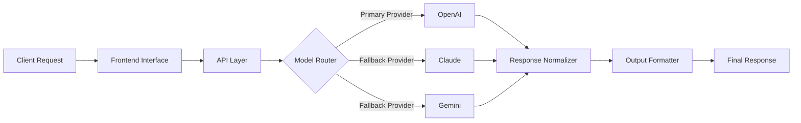

<div align="center">

# 👋 Hi, I'm Samuel Alayande

### AI Product Engineer • Technical Founder • Multi-Model AI Systems • Fintech • Real-Time Platforms

I design and build scalable, production-minded systems across **AI, fintech, marketplaces, and real-time platforms** — with a strong focus on **architecture, reliability, backend logic, and product-driven engineering**.

<br />

[](https://github.com/SamuelKunle)

<br />
<br />


</div>

---

<div align="center">

## Architecture-first engineering for AI products, backend systems, and scalable platforms

</div>

<p align="center">
  <strong>AI Platforms</strong> •
  <strong>LLM Routing</strong> •
  <strong>Backend Architecture</strong> •
  <strong>Fintech Systems</strong> •
  <strong>Real-Time Infrastructure</strong> •
  <strong>Marketplace Platforms</strong>
</p>

---

## 🧭 Engineering Identity

I build systems where **product thinking meets backend architecture**.

My work focuses on designing practical, scalable, and reliable software systems that can support real users, real workflows, and real product growth. I enjoy working across the full product stack — from backend services and API design to frontend experience, AI workflows, database structure, and system reliability.

> **Production codebases are private.**  
> Public repositories focus on **architecture, system design, implementation patterns, engineering documentation, and public-safe technical demonstrations**.

---

## 🚀 Current Focus

```txt
SoroNow AI
├── All-in-one AI workspace
├── Multi-model AI architecture
├── AI chat and productivity workflows
├── Writing, research, business, and document tools
├── File utilities and content workflows
├── Provider abstraction and fallback logic
├── API orchestration and response normalization
└── Production-minded AI platform engineering
```

I am currently building and evolving **SoroNow AI** — an all-in-one AI workspace designed to help users chat, write, research, analyze documents, generate content, convert files, and complete productivity tasks faster using intelligent AI tools.

---

## 🧠 System Architecture

### Multi-Model LLM Routing Example



This architecture pattern demonstrates how I think about **provider abstraction, fallback strategies, AI routing, normalized responses, and resilient product experiences**.

---

## 🔧 Featured Systems

<table>
  <tr>
    <td width="50%">
      <h3>
        <a href="https://github.com/SamuelKunle/ai-saas-starter">AI SaaS Platform</a>
      </h3>
      <p>
        Full-stack architecture for building AI-powered SaaS products using Next.js and FastAPI.
      </p>
      <p>
        <strong>Focus:</strong> AI workflows, SaaS structure, API design, authentication patterns, frontend/backend separation, and product-ready architecture.
      </p>
      <p>
        <code>Next.js</code> <code>FastAPI</code> <code>AI SaaS</code> <code>Architecture</code>
      </p>
    </td>
    <td width="50%">
      <h3>
        <a href="https://github.com/SamuelKunle/llm-routing-engine">LLM Routing Engine</a>
      </h3>
      <p>
        Backend system for multi-model AI routing, fallback logic, provider abstraction, and response normalization.
      </p>
      <p>
        <strong>Focus:</strong> OpenAI, Claude, Gemini, model selection, fallback handling, response formatting, and resilient AI infrastructure.
      </p>
      <p>
        <code>LLM Routing</code> <code>Fallbacks</code> <code>AI Infra</code> <code>Normalization</code>
      </p>
    </td>
  </tr>
  <tr>
    <td width="50%">
      <h3>
        <a href="https://github.com/SamuelKunle/fintech-transaction-system">Fintech Transaction System</a>
      </h3>
      <p>
        Architecture-focused backend demonstrating wallet flows, transaction lifecycle, financial system design, and reliability thinking.
      </p>
      <p>
        <strong>Focus:</strong> Wallet logic, transaction states, balance consistency, failure handling, rollback thinking, and backend reliability.
      </p>
      <p>
        <code>Fintech</code> <code>Wallets</code> <code>Transactions</code> <code>Reliability</code>
      </p>
    </td>
    <td width="50%">
      <h3>
        <a href="https://github.com/SamuelKunle/realtime-alert-system">Real-Time Alert System</a>
      </h3>
      <p>
        Event-driven backend system for real-time tracking, alert workflows, escalation logic, and notification patterns.
      </p>
      <p>
        <strong>Focus:</strong> Real-time systems, event flows, alert escalation, session tracking, and safety-focused infrastructure.
      </p>
      <p>
        <code>Real-Time</code> <code>Events</code> <code>Alerts</code> <code>Escalation</code>
      </p>
    </td>
  </tr>
  <tr>
    <td width="50%">
      <h3>
        <a href="https://github.com/SamuelKunle/marketplace-system">Marketplace System</a>
      </h3>
      <p>
        System design for a scalable multi-category marketplace platform with structured listings and search.
      </p>
      <p>
        <strong>Focus:</strong> Marketplace architecture, listings, product structure, search, filtering, and scalable catalog design.
      </p>
      <p>
        <code>Marketplace</code> <code>Search</code> <code>Listings</code> <code>Catalog</code>
      </p>
    </td>
    <td width="50%">
      <h3>Engineering Pattern Library</h3>
      <p>
        Public-safe examples that communicate how I structure systems, think through backend flows, and document scalable implementation patterns.
      </p>
      <p>
        <strong>Focus:</strong> System clarity, documentation, architecture thinking, and production-minded engineering communication.
      </p>
      <p>
        <code>System Design</code> <code>Docs</code> <code>Backend Patterns</code> <code>Product Thinking</code>
      </p>
    </td>
  </tr>
</table>

---

## 🧩 Core Engineering Areas

<table>
  <tr>
    <td width="33%">
      <h3>AI Systems</h3>
      <ul>
        <li>Multi-model AI integration</li>
        <li>LLM routing architecture</li>
        <li>Provider abstraction</li>
        <li>Fallback strategies</li>
        <li>Response normalization</li>
        <li>AI workflow orchestration</li>
      </ul>
    </td>
    <td width="33%">
      <h3>Full-Stack Engineering</h3>
      <ul>
        <li>Next.js applications</li>
        <li>React interfaces</li>
        <li>FastAPI backend services</li>
        <li>REST API design</li>
        <li>Authentication flows</li>
        <li>Responsive product UI</li>
      </ul>
    </td>
    <td width="33%">
      <h3>Backend Architecture</h3>
      <ul>
        <li>API orchestration</li>
        <li>Service-layer design</li>
        <li>Database-backed workflows</li>
        <li>Async backend systems</li>
        <li>Event-driven patterns</li>
        <li>Reliability-focused logic</li>
      </ul>
    </td>
  </tr>
</table>

---

## 🛠️ Tech Stack

<div align="center">

### Languages & Frameworks


<br />
<br />

### Databases & Platforms


<br />
<br />

### AI & Product Infrastructure


<br />
<br />


</div>

---

## 📊 GitHub Overview

<div align="center">


<br />
<br />


<br />
<br />


<br />
<br />


</div>

---

## 🐍 Contribution Flow

<div align="center">

<picture>
  <source media="(prefers-color-scheme: dark)" srcset="https://raw.githubusercontent.com/SamuelKunle/SamuelKunle/output/github-contribution-grid-snake-dark.svg">
  <source media="(prefers-color-scheme: light)" srcset="https://raw.githubusercontent.com/SamuelKunle/SamuelKunle/output/github-contribution-grid-snake.svg">
  
</picture>

</div>

---

## 🌍 Current Direction

<table>
  <tr>
    <td width="33%">
      <h3>SoroNow AI</h3>
      <p>
        An all-in-one AI workspace with multi-model architecture, productivity tools, document intelligence, and AI-powered workflows.
      </p>
    </td>
    <td width="33%">
      <h3>Fintech Systems</h3>
      <p>
        Backend systems for wallet logic, transaction lifecycle, balance consistency, failure handling, and financial workflow design.
      </p>
    </td>
    <td width="33%">
      <h3>Real-Time Platforms</h3>
      <p>
        Event-driven systems for alerts, tracking, escalation logic, notifications, monitoring, and real-time product infrastructure.
      </p>
    </td>
  </tr>
</table>

---

## 🧠 How I Think About Systems

```txt
Good products need more than features.

They need:
├── Clear architecture
├── Reliable backend logic
├── Scalable data flow
├── Practical API design
├── Smooth user experience
├── Failure-aware engineering
├── Strong documentation
└── Product thinking from day one
```

---

## 🧱 Engineering Principles

<table>
  <tr>
    <td width="50%">
      <h3>Reliability First</h3>
      <p>
        I think through failure states, fallback paths, transaction consistency, and predictable system behavior before scaling features.
      </p>
    </td>
    <td width="50%">
      <h3>Product-Aware Architecture</h3>
      <p>
        I design systems around real user flows, not just technical abstraction. The architecture should support the product experience.
      </p>
    </td>
  </tr>
  <tr>
    <td width="50%">
      <h3>Clean System Boundaries</h3>
      <p>
        I value clear service responsibilities, clean API contracts, readable workflows, and maintainable implementation patterns.
      </p>
    </td>
    <td width="50%">
      <h3>Documented Thinking</h3>
      <p>
        I use documentation and public-safe repositories to communicate architecture, decision-making, and engineering tradeoffs.
      </p>
    </td>
  </tr>
</table>

---

## 🤝 Open To

<table>
  <tr>
    <td width="50%">
      <strong>AI Product Engineering roles</strong>
      <br />
      Building AI-powered products, multi-model systems, and intelligent workflows.
    </td>
    <td width="50%">
      <strong>Backend / Full-Stack Engineering opportunities</strong>
      <br />
      Designing scalable APIs, product systems, dashboards, and backend services.
    </td>
  </tr>
  <tr>
    <td width="50%">
      <strong>Startup collaborations</strong>
      <br />
      Working on AI, fintech, real-time platforms, marketplaces, and product infrastructure.
    </td>
    <td width="50%">
      <strong>Technical partnerships</strong>
      <br />
      Helping shape architecture, system design, implementation patterns, and product direction.
    </td>
  </tr>
</table>

---

## 📫 Contact

<div align="center">

### Let’s connect around AI systems, fintech infrastructure, real-time platforms, marketplaces, and product-driven engineering.

<br />

📧 [samuelkunle316@gmail.com](mailto:samuelkunle316@gmail.com)

</div>

---

<div align="center">


### Building systems with clarity, reliability, and product purpose.

</div>
