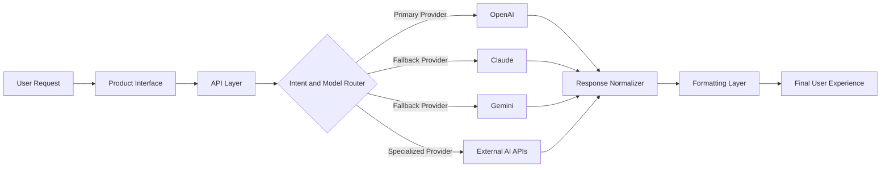

<div align="center">

# 👋 Hi, I'm Samuel Alayande

### AI Product Engineer • Full-Stack Engineer • Systems Architect • Technical Founder

I design and build scalable, production-minded software systems across **AI platforms, fintech products, marketplaces, real-time infrastructure, automation tools, and backend-driven web systems**.

My work sits at the intersection of **software engineering, product thinking, backend architecture, AI infrastructure, and real-world system reliability**.

<br />

[](https://github.com/SamuelKunle)

<br />
<br />


</div>

---

<div align="center">

## Software engineering with architecture, product clarity, and production reliability.

</div>

<p align="center">
  <strong>AI Systems</strong> •
  <strong>Full-Stack Engineering</strong> •
  <strong>Backend Architecture</strong> •
  <strong>Fintech Infrastructure</strong> •
  <strong>Real-Time Platforms</strong> •
  <strong>Marketplace Systems</strong> •
  <strong>Automation Tools</strong>
</p>

---

## 🧭 Engineering Identity

I am a software engineer and technical founder with experience building and operating systems across **web platforms, internal tools, AI products, fintech workflows, real-time applications, and business-critical digital infrastructure**.

My strength is not only writing code. It is understanding the product problem, shaping the system architecture, building reliable backend logic, creating usable frontend experiences, and documenting engineering decisions clearly.

I enjoy working across the full product stack — from idea and architecture to implementation, deployment, reliability, and iteration.

```txt
Product idea
├── User problem and workflow
├── System architecture
├── Data model and backend logic
├── API design and integrations
├── Frontend experience
├── Reliability and failure handling
├── Deployment and iteration
└── Documentation for long-term maintainability
```

> **Production codebases are private.**  
> Public repositories focus on **architecture, system design, public-safe implementation patterns, engineering documentation, and technical demonstrations**.

---

## 🚀 Current Focus

```txt
SoroNow AI
├── All-in-one AI workspace
├── 50+ AI-powered tools
├── Multi-model AI orchestration
├── Writing, research, business, and content workflows
├── Document analysis and productivity utilities
├── File tools and media generation workflows
├── Provider abstraction and fallback logic
├── Response normalization and formatting systems
├── Frontend UX and mobile-first product polish
└── Production-minded AI platform engineering
```

I am currently building and evolving **SoroNow AI** — an all-in-one AI workspace designed to help users chat, write, research, analyze documents, generate content, convert files, and complete productivity tasks faster using intelligent AI tools.

The platform combines **AI product engineering, full-stack development, API orchestration, backend reliability, frontend experience, and multi-model infrastructure**.

---

## 🧠 System Architecture

### Multi-Model AI Routing Example



This architecture pattern demonstrates how I approach **provider abstraction, fallback strategies, AI routing, normalized responses, resilient UX, and production-grade AI product behavior**.

---

## 🔧 Featured Systems

<table>
  <tr>
    <td width="50%" valign="top">
      <h3>
        <a href="https://github.com/SamuelKunle/ai-saas-starter">AI SaaS Platform</a>
      </h3>
      <p>
        Full-stack architecture for building AI-powered SaaS products with a clean separation between frontend, backend, authentication, AI workflows, and product features.
      </p>
      <p>
        <strong>Focus:</strong> SaaS structure, AI workflows, API design, authentication patterns, product-ready architecture, and scalable app foundations.
      </p>
      <p>
        <code>Next.js</code> <code>FastAPI</code> <code>AI SaaS</code> <code>Architecture</code>
      </p>
    </td>
    <td width="50%" valign="top">
      <h3>
        <a href="https://github.com/SamuelKunle/llm-routing-engine">LLM Routing Engine</a>
      </h3>
      <p>
        Backend system pattern for multi-model AI routing, fallback logic, provider abstraction, response normalization, and resilient AI infrastructure.
      </p>
      <p>
        <strong>Focus:</strong> OpenAI, Claude, Gemini, model selection, fallback handling, response formatting, and AI reliability patterns.
      </p>
      <p>
        <code>LLM Routing</code> <code>Fallbacks</code> <code>AI Infra</code> <code>Normalization</code>
      </p>
    </td>
  </tr>

  <tr>
    <td width="50%" valign="top">
      <h3>
        <a href="https://github.com/SamuelKunle/fintech-transaction-system">Fintech Transaction System</a>
      </h3>
      <p>
        Architecture-focused backend system demonstrating wallet flows, transaction lifecycle design, balance integrity, failure handling, and financial reliability thinking.
      </p>
      <p>
        <strong>Focus:</strong> Wallet logic, ledgers, transaction states, idempotency, reconciliation, rollback thinking, and backend correctness.
      </p>
      <p>
        <code>Fintech</code> <code>Wallets</code> <code>Transactions</code> <code>Reliability</code>
      </p>
    </td>
    <td width="50%" valign="top">
      <h3>
        <a href="https://github.com/SamuelKunle/realtime-alert-system">Real-Time Alert System</a>
      </h3>
      <p>
        Event-driven backend system for real-time tracking, alert workflows, escalation logic, notification flows, and safety-focused infrastructure.
      </p>
      <p>
        <strong>Focus:</strong> Real-time systems, event flows, alert escalation, session tracking, notifications, and resilience.
      </p>
      <p>
        <code>Real-Time</code> <code>Events</code> <code>Alerts</code> <code>Escalation</code>
      </p>
    </td>
  </tr>

  <tr>
    <td width="50%" valign="top">
      <h3>
        <a href="https://github.com/SamuelKunle/marketplace-system">Marketplace System</a>
      </h3>
      <p>
        System design for a scalable multi-category marketplace platform with flexible listings, structured catalog design, search, filtering, and business workflows.
      </p>
      <p>
        <strong>Focus:</strong> Marketplace architecture, listings, product structure, search design, filtering, and scalable catalog systems.
      </p>
      <p>
        <code>Marketplace</code> <code>Search</code> <code>Listings</code> <code>Catalog</code>
      </p>
    </td>
    <td width="50%" valign="top">
      <h3>Automation & Workflow Systems</h3>
      <p>
        Backend-driven automation patterns for communication workflows, business operations, productivity tools, and intelligent customer engagement systems.
      </p>
      <p>
        <strong>Focus:</strong> Workflow automation, queues, messaging APIs, integrations, task orchestration, and operational tooling.
      </p>
      <p>
        <code>Automation</code> <code>APIs</code> <code>Workflows</code> <code>Operations</code>
      </p>
    </td>
  </tr>
</table>

---

## 🧩 Core Engineering Areas

<table>
  <tr>
    <td width="33%" valign="top">
      <h3>AI Systems</h3>
      <ul>
        <li>Multi-model AI integration</li>
        <li>LLM routing architecture</li>
        <li>Provider abstraction</li>
        <li>Fallback strategies</li>
        <li>Response normalization</li>
        <li>AI workflow orchestration</li>
        <li>Document intelligence</li>
        <li>Prompt and output systems</li>
      </ul>
    </td>
    <td width="33%" valign="top">
      <h3>Frontend Engineering</h3>
      <ul>
        <li>React and Next.js applications</li>
        <li>Vue-based interfaces</li>
        <li>TypeScript product UI</li>
        <li>Responsive layouts</li>
        <li>Mobile-first UX</li>
        <li>Tailwind, Bootstrap, Sass, CSS</li>
        <li>Product dashboards</li>
        <li>Accessible web interfaces</li>
      </ul>
    </td>
    <td width="33%" valign="top">
      <h3>Backend Engineering</h3>
      <ul>
        <li>FastAPI services</li>
        <li>Node.js and Express APIs</li>
        <li>Django and Laravel systems</li>
        <li>REST API design</li>
        <li>Authentication workflows</li>
        <li>Database-backed logic</li>
        <li>Async backend systems</li>
        <li>Service-layer architecture</li>
      </ul>
    </td>
  </tr>

  <tr>
    <td width="33%" valign="top">
      <h3>Data & Databases</h3>
      <ul>
        <li>PostgreSQL data modeling</li>
        <li>MySQL-backed systems</li>
        <li>MongoDB document workflows</li>
        <li>Supabase applications</li>
        <li>Redis-backed caching</li>
        <li>Transaction lifecycle logic</li>
        <li>Data integrity patterns</li>
        <li>Search and filtering systems</li>
      </ul>
    </td>
    <td width="33%" valign="top">
      <h3>Infrastructure</h3>
      <ul>
        <li>Cloud deployments</li>
        <li>AWS and Google Cloud awareness</li>
        <li>Dockerized services</li>
        <li>Vercel deployment workflows</li>
        <li>Git and GitHub workflows</li>
        <li>Linux environments</li>
        <li>System reliability</li>
        <li>Operational troubleshooting</li>
      </ul>
    </td>
    <td width="33%" valign="top">
      <h3>Product Systems</h3>
      <ul>
        <li>Fintech platforms</li>
        <li>Marketplace systems</li>
        <li>Real-time alert platforms</li>
        <li>Automation workflows</li>
        <li>Internal business tools</li>
        <li>Content and media tools</li>
        <li>Admin dashboards</li>
        <li>Technical documentation</li>
      </ul>
    </td>
  </tr>
</table>

---

## 🏗️ Broader Engineering Experience

<table>
  <tr>
    <td width="50%" valign="top">
      <h3>Product Platforms</h3>
      <p>
        Building complete products from idea to usable systems — including dashboards, user flows, authentication, backend services, integrations, and deployment-ready architecture.
      </p>
    </td>
    <td width="50%" valign="top">
      <h3>Business-Critical Web Systems</h3>
      <p>
        Designing and maintaining websites, internal tools, database-backed workflows, and operational systems that support real organizations and daily business needs.
      </p>
    </td>
  </tr>

  <tr>
    <td width="50%" valign="top">
      <h3>Fintech & Transaction Logic</h3>
      <p>
        Designing wallet systems, transaction states, balance consistency, audit trails, rollback thinking, and money-movement infrastructure patterns.
      </p>
    </td>
    <td width="50%" valign="top">
      <h3>Real-Time Infrastructure</h3>
      <p>
        Building event-driven systems for tracking, alerts, escalation workflows, live updates, notifications, and low-latency product experiences.
      </p>
    </td>
  </tr>

  <tr>
    <td width="50%" valign="top">
      <h3>IT Systems & Operations</h3>
      <p>
        Practical experience supporting internal systems, troubleshooting, device workflows, staff operations, software setup, and infrastructure reliability.
      </p>
    </td>
    <td width="50%" valign="top">
      <h3>Technical Documentation</h3>
      <p>
        Creating public-safe architecture documents, system diagrams, implementation notes, and engineering explanations that communicate how systems are designed.
      </p>
    </td>
  </tr>
</table>

---

## 🛠️ Languages, Tools & Technologies

<div align="center">

### Core Languages


<br />
<br />


<br />
<br />

### Frontend Engineering


<br />
<br />


<br />
<br />

### Backend Engineering


<br />
<br />


<br />
<br />

### Databases & Data Systems


<br />
<br />


<br />
<br />

### Cloud, DevOps & Infrastructure


<br />
<br />


<br />
<br />

### AI, Automation & Product Infrastructure


<br />
<br />

### Tools & Engineering Workflow


<br />
<br />


</div>

---

## 📊 GitHub Overview

<div align="center">


<br />
<br />


<br />
<br />


</div>

---

## 📈 Live Contribution Activity

<div align="center">


</div>

---

## 🌍 Selected Product Directions

<table>
  <tr>
    <td width="33%" valign="top">
      <h3>SoroNow AI</h3>
      <p>
        An all-in-one AI workspace with multi-model architecture, productivity tools, document intelligence, content workflows, and AI-powered utilities.
      </p>
    </td>
    <td width="33%" valign="top">
      <h3>AEGIOS</h3>
      <p>
        Fintech system direction focused on accounts, wallets, transactions, financial operations, data integrity, and reliable backend workflows.
      </p>
    </td>
    <td width="33%" valign="top">
      <h3>WakaRail</h3>
      <p>
        Real-time safety platform direction for journey tracking, SOS alerts, guardian monitoring, escalation flows, and live infrastructure.
      </p>
    </td>
  </tr>

  <tr>
    <td width="33%" valign="top">
      <h3>JaraBizz</h3>
      <p>
        Multi-category marketplace direction for cars, properties, jobs, services, structured listings, flexible search, and scalable catalog design.
      </p>
    </td>
    <td width="33%" valign="top">
      <h3>Praktera</h3>
      <p>
        Automation platform direction for AI-powered customer engagement, communication workflows, messaging APIs, and operational productivity.
      </p>
    </td>
    <td width="33%" valign="top">
      <h3>System Design Library</h3>
      <p>
        Public-safe architecture examples showing how I think through backend flows, reliability, product systems, and implementation patterns.
      </p>
    </td>
  </tr>
</table>

---

## 🧠 How I Think About Systems

```txt
Good software is not only about features.

It needs:
├── Clear architecture
├── Reliable backend logic
├── Practical API design
├── Strong data modeling
├── Smooth user experience
├── Failure-aware engineering
├── Secure authentication flows
├── Scalable infrastructure thinking
├── Maintainable documentation
└── Product purpose from day one
```

---

## 🧱 Engineering Principles

<table>
  <tr>
    <td width="50%" valign="top">
      <h3>Reliability First</h3>
      <p>
        I think through failure states, fallback paths, transaction consistency, retries, edge cases, and predictable system behavior before scaling features.
      </p>
    </td>
    <td width="50%" valign="top">
      <h3>Product-Aware Architecture</h3>
      <p>
        I design systems around real user flows, not just technical abstraction. The architecture should support the actual product experience.
      </p>
    </td>
  </tr>

  <tr>
    <td width="50%" valign="top">
      <h3>Clean System Boundaries</h3>
      <p>
        I value clear service responsibilities, clean API contracts, readable workflows, maintainable code structure, and practical separation of concerns.
      </p>
    </td>
    <td width="50%" valign="top">
      <h3>Documentation as Proof</h3>
      <p>
        I use documentation, diagrams, and public-safe repositories to communicate architecture, decision-making, tradeoffs, and engineering maturity.
      </p>
    </td>
  </tr>

  <tr>
    <td width="50%" valign="top">
      <h3>End-to-End Ownership</h3>
      <p>
        I can move from product idea to architecture, implementation, deployment, testing, UI polish, and continuous improvement.
      </p>
    </td>
    <td width="50%" valign="top">
      <h3>Practical Engineering</h3>
      <p>
        I care about systems that actually work in the real world — with real users, real constraints, real errors, and real business needs.
      </p>
    </td>
  </tr>
</table>

---

## 📌 Experience Snapshot

```txt
12+ years building software, web systems, IT workflows, and product platforms

Experience across:
├── AI product engineering
├── Full-stack web development
├── Backend systems
├── Fintech architecture
├── Real-time platforms
├── Marketplace systems
├── Automation workflows
├── IT systems administration
├── Database-backed applications
└── Production product ownership
```

My background includes hands-on engineering across **SoroNow AI, fintech systems, real-time safety platforms, marketplace products, automation tools, business websites, internal systems, and IT operations**.

---

## 🤝 Open To

<table>
  <tr>
    <td width="50%" valign="top">
      <strong>AI Product Engineering roles</strong>
      <br />
      Building AI-powered products, multi-model systems, workflow tools, and intelligent product experiences.
    </td>
    <td width="50%" valign="top">
      <strong>Full-Stack / Backend Engineering roles</strong>
      <br />
      Designing scalable APIs, product systems, dashboards, backend services, and database-backed workflows.
    </td>
  </tr>

  <tr>
    <td width="50%" valign="top">
      <strong>Startup and founding engineering work</strong>
      <br />
      Helping shape products from zero to scale across AI, fintech, marketplaces, automation, and infrastructure.
    </td>
    <td width="50%" valign="top">
      <strong>Technical partnerships</strong>
      <br />
      Supporting architecture, system design, implementation patterns, product strategy, and engineering execution.
    </td>
  </tr>
</table>

---

## 📫 Contact

<div align="center">

### Let’s connect around AI systems, backend architecture, fintech infrastructure, real-time platforms, marketplaces, automation, and product-driven engineering.

<br />

📧 [samuelkunle316@gmail.com](mailto:samuelkunle316@gmail.com)

<br />
<br />

<a href="https://samuelalayande.dev">Portfolio</a> •
<a href="https://github.com/SamuelKunle">GitHub</a> •
<a href="mailto:samuelkunle316@gmail.com">Email</a>

</div>

---

<div align="center">


### Building software systems with clarity, reliability, and product purpose.

</div>
