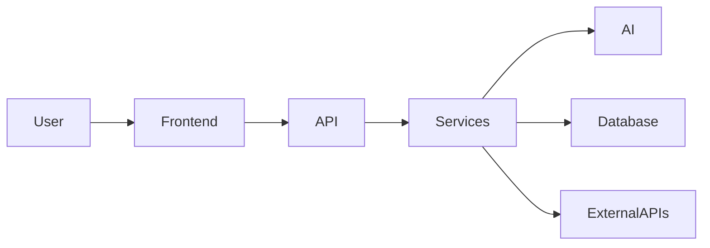

# 👋 Hi, I'm Samuel Alayande

🚀 AI Product Engineer • Technical Founder • Multi-Model AI Systems • Fintech • Real-Time Platforms

I design and build scalable, production-ready systems across AI, fintech, marketplaces, and real-time platforms — with a strong focus on architecture, reliability, and product-driven engineering.

*Production codebases are private — public repositories focus on architecture, system design, and engineering patterns.*

---

## 🏗️ System Overview

---

## 🚀 Featured Systems

* [AI SaaS Platform](https://github.com/SamuelKunle/ai-saas-starter)
  Full-stack architecture for building AI-powered SaaS products using Next.js and FastAPI.

* [LLM Routing Engine](https://github.com/SamuelKunle/llm-routing-engine)
  Backend system for multi-model AI routing, fallback logic, and response normalization.

* [Fintech Transaction System](https://github.com/SamuelKunle/fintech-transaction-system)
  Architecture-focused backend demonstrating wallet flows, transaction lifecycle, and financial system design.

* [Real-Time Alert System](https://github.com/SamuelKunle/realtime-alert-system)
  Event-driven backend system for real-time tracking, alert workflows, and escalation logic.

* [Marketplace System](https://github.com/SamuelKunle/marketplace-system)
  System design for a scalable multi-category marketplace platform with structured listings and search.

---

## 🧠 What I Build & Expertise

* AI-powered systems using multi-model architectures (OpenAI, Claude, Gemini)
* Full-stack applications with Next.js and FastAPI
* Scalable APIs, backend services, and workflow orchestration
* Event-driven and real-time systems
* Product-focused backend architecture and system design

### Core Areas

**AI Systems**

* Multi-model AI integration and orchestration
* Routing, fallback strategies, and provider abstraction
* AI workflows and response normalization

**Full-Stack Engineering**

* Frontend: Next.js, React (modern, responsive UI)
* Backend: FastAPI, REST APIs, async systems
* Database: PostgreSQL, Supabase, MSSQL

**System Architecture**

* API orchestration and service design
* Scalable and distributed system thinking
* Real-time and event-driven systems

---

## 🛠️ Tech Stack

Python • JavaScript • FastAPI • React • Next.js
PostgreSQL • Supabase • MSSQL
OpenAI • Claude • Gemini • OpenRouter

---

## 🌍 Current Focus

Currently building and evolving real-world systems including:

* SoroNow AI — an all-in-one AI workspace with multi-model architecture
* Scalable backend systems for fintech and real-time applications
* Product-driven platforms that combine AI, system design, and user experience

Focused on pushing systems from architecture → production-ready platforms.

---

## 🤝 Open To

* AI product engineering roles
* Backend / full-stack engineering opportunities
* Startup collaborations
* Technical partnerships on product-driven systems

---

## 📫 Contact

📧 [samuelkunle316@gmail.com](mailto:samuelkunle316@gmail.com)
